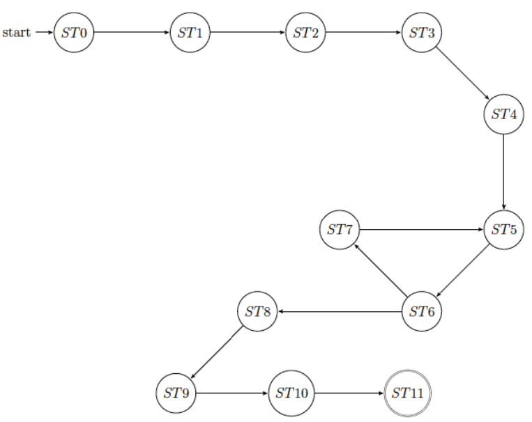

# rectangle-vhdl
A component that creates the smallest rectangle encompassing an areia

## 
From the start state (ST0) one waits until the reset signal rises and brings the signal o_done = 0 and then waits until the Start signal arrives.
When this happens you switch to state 1.

1. State 1 (ST1) initialises everything and requests the number of columns.
1. State 2 (ST2) saves the number of columns and asks for the number of rows.
1. State 3 (ST3) saves the number of rows and then asks for the threshold value.
1. State 4 (ST4) saves the threshold value, then asks for the element of the matrix (at position 0 ,0).
1. State 5 (ST5) takes the value of the requested cell, increments the value of the current row and current column (simulating the natural scrolling of rows and columns of an array) and then requests the number contained in the next cell .
1. In state 6 (ST6) it is checked whether the number of cells has actually been exceeded, or whether the scrolling of the matrix (with the consequent check) has not yet been completed: if the machine has exceeded the address of the last element of the matrix then it moves on to the area calculation state; if it has not exceeded it, then it enters another state in which it first requests the next cell, then continues the computation.
1. So if the machine has not passed the last matrix element, from (ST6) it goes to (ST7) which then returns to state 5 (ST5).

To test the component described above, the tests proposed on were tried, to which customised tests were added. In the latter, normal cases were covered, with full or no matrix, with an area almost as large as the entire matrix (due to numbers above the threshold at the vertices) and with a matrix of almost as large as the RAM. Below are some of the test cases mentioned above.

Null Matrix:

ram_type:= (2 => "00000000", 3 =>"00000000",4 => "00000000", others => (others =>'0'));
assert RAM(1) = "00000000" report "FAIL high bits" severity failure;
assert RAM(0) = "00000000" report "FAIL low bits" severity failure;

Full Matrix:

ram_type:= (2 => "00000010", 3 =>"00000001",4 => "00000000",others =>(others =>'0'));
assert RAM(1) = "00000000" report "FAIL high bits" severity failure;
assert RAM(0) = "00000010" report "FAIL low bits" severity failure;

More 1s than 0:

ram_type := (2 =>"00000110",3 => "11001000",4 => "01100010", 5 => "00000001", 6 => "00000010", 7 => "00000101", 8 => "00000000", 9 => "00001010", 10 => "00010100", 11 => "00000100", 12 => "00001010", 13 => "00011100", 14 => "00100000", 15 => "00000001", 16 => "00000000", 17 => "11111100", 18 => "11100010", 19 => "11100010", 20 => "11100110", 21 => "11110010", 22 => "11101001", 23 => "11100110", 24 => "11110000", 25 => "11100111", 26 => "11111010", 27 => "11110100", 28 => "11101000", 29 => "11111000", 30 => "11111000", 31 => "11101110", 32 => "11101110", 33 => "11100001", 34 => "11111000", others => (others =>'1'));
assert RAM(1) = "00000100" report "FAIL high bits" severity failure;
assert RAM(0) = "10100100" report "FAIL low bits" severity failure;

Normal Matrix, many elements:

ram_type := (2 => "11111111", 3 =>"11111111",4 => "00000000", 30 => "00000011", 31 => "00000011", 32 => "00000011", 33 => "00000011", 36 => "00000111", 37 => "00000111", 38 => "00000111", 39 => "00000111", 42 => "00001011", 43 => "00001011", 44 => "00001011", 45 => "00001011", 48 => "00001111", 54 => "00000011", 60 => "00000111", 66 => "00011111", 72 => "00011001", 78 => "00000011", 79 => "00000011", 80 => "00000011", 84 => "00000111", 85 => "00000111", 86 => "00000111", 90 => "00011111", 91 => "00011111", 92 => "00011111", 96 => "00011001", 102 => "00000011", 108 => "00000111", 114 => "00011111", 120 => "00011001", 126 => "00000011", 132 => "00000111", 133 => "00000111", 134 => "00000111", 135 => "00000111", 138 => "00001011", 139 => "00001011", 140 => "00001011", 141 => "00001011", 144 => "00001111", 145 => "00001111", 146 => "00001111", 147 => "00001111", others => (others =>'0'));
assert RAM(1) = "11111110" report "FAIL high bits" severity failure;
assert RAM(0) = "00000001" report "FAIL low bits" severity failure;